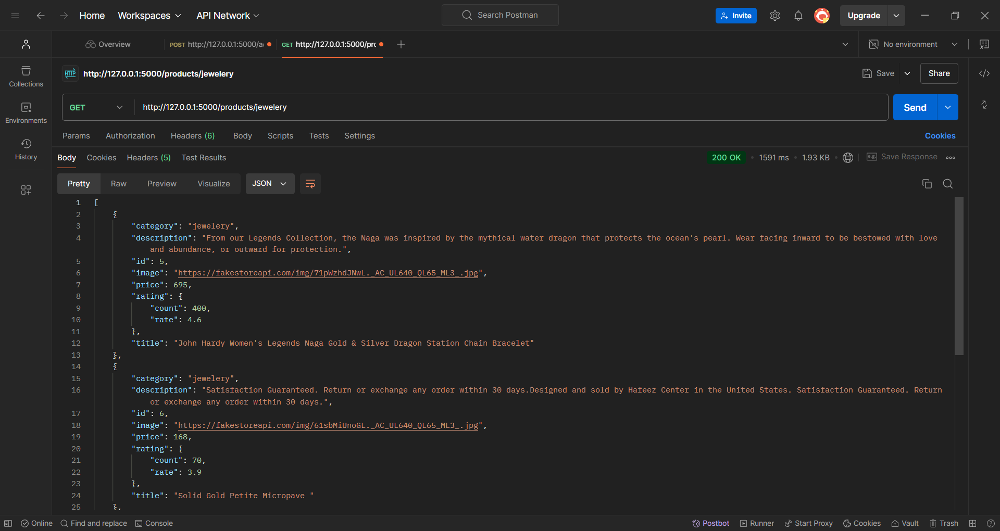
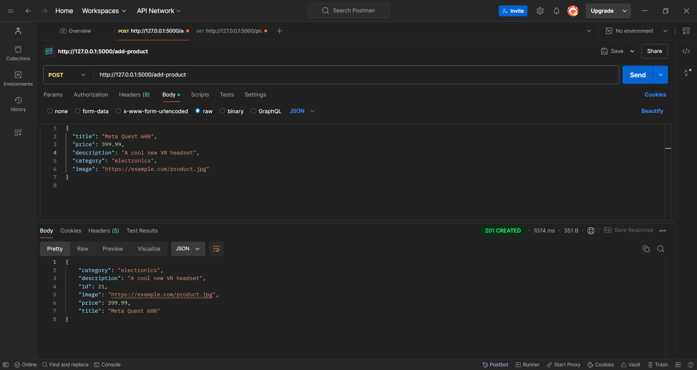

# Prospecta Technical Assessment Solution

A Flask-based REST API solution for the Prospecta technical assessment that interacts with the Fake Store API.

## Assessment Overview

The assessment required creating two API endpoints that interact with [Fake Store API](https://fakestoreapi.com):

1. An endpoint to fetch product details by category
2. An endpoint to add new products

## Features

- GET endpoint to retrieve products by category
- POST endpoint to add new products
- Error handling for API communication
- JSON response format
- HTTP status code handling

## Technology Stack

- Python 3.11
- Flask (Web Framework)
- Requests library (HTTP client)

## Usage

1. Start the Flask server
```bash
python app.py
```

The server will start on `http://localhost:5000`

### API Endpoints

1. **Get Products by Category**
   - Endpoint: `GET /products/<category>`
   - Example: `GET /products/electronics`

2. **Add New Product**
   - Endpoint: `POST /add-product`
   - Request Body Example:
   ```json
   {
     "title": "New Product",
     "price": 99.99,
     "description": "Product description",
     "category": "electronics",
     "image": "https://example.com/image.jpg"
   }
   ```
   - Response: Returns the created product with an ID

## Screenshots of work
1. **Task 1:**

2. **Task 2:**


## Error Handling

The API includes error handling for:
- 404 Not Found responses
- 500 Internal Server errors
- Invalid API responses
- Network communication issues

## License

[MIT](LICENSE)
